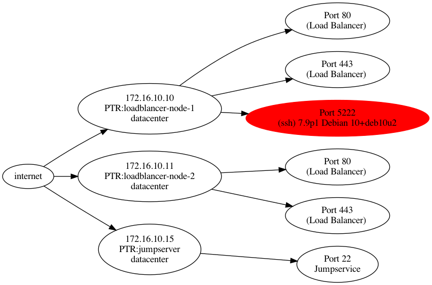

# Servicedef

WIP: Code doesn't match readme

## Description

Servicedef lets you compare a list of service definitions against a list of hosts.

Servicedefinitions are a JSON structure and can be created manually or could be generated from existing documentation.
services.json:
```
[{
	"id":"Load Balancer",
	"description":"main httpd",
	"ports":[
		{
		"port":80,
		"hosts":["172.16.10.10","172.16.10.11"]
		},{
		"port":443,
		"hosts":["172.16.10.10","172.16.10.11"]
		}
	]
},{

	"id":"Jumpservice",
	"description":"ssh jumpservice",
	"ports":[{
		"port":22,
		"hosts":["172.16.10.15"]
		}]
}]
```

Hosts are also stored in a flat JSON structure.
hosts.json:
```
[{
"ip":"172.16.10.0/24",
"name":"datacenter"
}]
```

Running servicedef with this examples can produce the following output:
```
2021/08/18 00:39:21 servicedef v0
2021/08/18 00:39:21 parsing services file...
2021/08/18 00:39:21 Services #: 2
2021/08/18 00:39:21 Service: Load Balancer [80 443] - main httpd
2021/08/18 00:39:21 Service: Jumpservice [22] - ssh jumpservice
2021/08/18 00:39:21 parsing services file finished
2021/08/18 00:39:21 parsing hosts file...
2021/08/18 00:39:21 Host: 172.16.10.0/24 datacenter
2021/08/18 00:39:21 parsing hosts file finished
2021/08/18 00:39:21 portscanning hosts, this might take a really long time...
2021/08/18 00:39:21 [worker_1] scanning 172.16.10.0/24
2021/08/18 00:39:21 [worker_1] [localhost] nmap done: 1 hosts up scanned in 0.330000 seconds
2021/08/18 00:39:21 [worker_1] finished queue
2021/08/18 00:39:40 scanning hosts finished
2021/08/18 00:39:40 checking services...
2021/08/18 00:39:40 ! [172.16.10.10] 5222 open: no service definition found (ssh 7.9p1 Debian 10+deb10u2)
2021/08/18 00:39:40 finished checking services
2021/08/18 00:39:40 finished
```

In this case servicedef reported an unknown open port 5222 with a running sshd.

Results can also be exported as graphviz dot file:



## Requirements

Servicedef uses nmap for host discovery and portscanning.
Nmap must be installed on the system.

It also uses Syn-Stealth-Scans which requires root privileges.

If you run into the following error check privileges:

> unable to run nmap scan: unable to parse nmap output, see warnings for details exit status 1

## Options

```
./servicedef <services.json> <hosts.json>
```

| Switch | Default | Description |
| --- | --- | --- |
| -p | false | print nmap progress in logfile every 60 seconds
| -s | false | don't print to stdout |
| -l <logfile> | -l scan.log | write logs to <logfile> |
| -g <graphviz dotfile> | false | export results as <graphviz dotfile> |
| -a | false | Use nmap ack scan (doesn't require root privileges) |
| -f | false | Use nmap fast scan instead of scanning for all ports |

## Graphviz Export
```cat graph.dot | dot -Grankdir=LR -Tpdf > graph.pdf && open graph.pdf```
