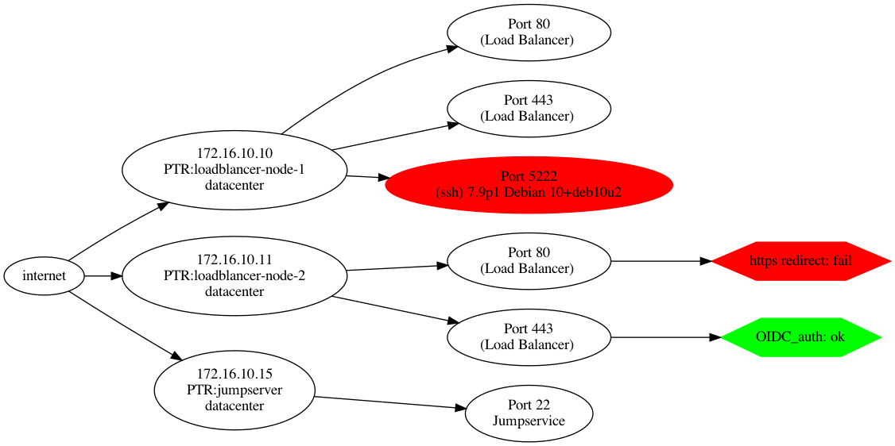

# Servicedef

## Description

Servicedef lets you compare a list of service definitions against a list of hosts.

Servicedefinitions are a JSON structure and can be created manually or could be generated from existing documentation.
services.json:
```json
[{
	"id":"Load Balancer",
	"description":"main httpd",
	"ports":[
		{
		"port":80,
		"hosts":["172.16.10.10","172.16.10.11"]
		},{
		"port":443,
		"hosts":["172.16.10.10","172.16.10.11"]
		}
	]
},{

	"id":"Jumpservice",
	"description":"ssh jumpservice",
	"ports":[{
		"port":22,
		"hosts":["172.16.10.15"]
		}]
}]
```

Hosts are also stored in a flat JSON structure.
hosts.json:
```json
[{
"address":"172.16.10.0/24",
"description":"datacenter"
}]
```

Running servicedef with this examples can produce the following output:
```
2021/08/18 00:39:21 servicedef v0
2021/08/18 00:39:21 parsing services file...
2021/08/18 00:39:21 Services #: 2
2021/08/18 00:39:21 Service: Load Balancer [80 443] - main httpd
2021/08/18 00:39:21 Service: Jumpservice [22] - ssh jumpservice
2021/08/18 00:39:21 parsing services file finished
2021/08/18 00:39:21 parsing hosts file...
2021/08/18 00:39:21 Host: 172.16.10.0/24 datacenter
2021/08/18 00:39:21 parsing hosts file finished
2021/08/18 00:39:21 portscanning hosts, this might take a really long time...
2021/08/18 00:39:21 [worker_1] scanning 172.16.10.0/24
2021/08/18 00:39:21 [worker_1] [localhost] nmap done: 1 hosts up scanned in 0.330000 seconds
2021/08/18 00:39:21 [worker_1] finished queue
2021/08/18 00:39:40 scanning hosts finished
2021/08/18 00:39:40 checking services...
2021/08/18 00:39:40 ! [172.16.10.10] 5222 open: no service definition found (ssh 7.9p1 Debian 10+deb10u2)
2021/08/18 00:39:40 finished checking services
2021/08/18 00:39:40 finished
```

In this case servicedef reported an unknown open port 5222 with a running sshd.

Results can also be exported as graphviz dot file:


### Service Rules

Service rules can be used to add additional checks to your service catalog.
Currently the available rule checker is "http" for status codes and http headers:
```json
[{
	"id":"Load Balancer",
	"description":"main httpd",
	"ports":[
		{
		"port":80,
		"hosts":["172.16.10.10","172.16.10.11"],
		"rules":["https-redirect"],
		"uri":"http://example-service.tld"
		},{
		"port":8080,
		"hosts":["172.16.10.10","172.16.10.11"],
		"rules":["basic_auth"],
		"uri":"https://example-service.tld:8080"
		},{
		"port":443,
		"hosts":["172.16.10.10","172.16.10.11"],
		"rules":["OIDC_auth"],
		"uri":"https://example-service.tld"
		}
	]
}]
```
`"uri"` is used for the probing, which might produce false results if you use techniques like dns round robin load balancing.

To check the rules use `-r rules.json` and define them:
```json
[{
"name":"https-redirect",
"type":"http",
"status":301,
"rules":[{"location":"https://example-service.tld", "contains":"Basic realm="}]
},{
"name":"basic_auth",
"type":"http",
"status":401,
"rules":[{"name":"WWW-Authenticate", "contains":"Basic realm="}]
},{
"name":"OIDC_auth",
"type":"http",
"status":302,
"rules":[{"name":"location", "contains":"https://idp.example-service.tld"}]
}]
```

Rule mismatches will be reported during service evaluation and are part of the graphviz export:




## Requirements

Servicedef uses nmap for host discovery and portscanning.
Nmap must be installed on the system.

It also uses syn scans by default which requires root privileges.
Use -c to switch back to nmaps connect scans (`-sT`).

If you run into the following error check privileges:

> unable to run nmap scan: unable to parse nmap output, see warnings for details exit status 1

## Options

```
./servicedef hosts.json [services.json]
```

| Switch | Default | Description |
| --- | --- | --- |
| -r | rules.json | use rules file |
| -p | 60 | print nmap progress, set 0 to disable |
| -q | false | quiet, don't print application logs to stdout |
| -g graphviz.dot | false | export results as graphviz dotfile |
| -t | 3 | number of parallel nmap scanning instances |
| -c | false | Use nmap connect scan (doesn't require root privileges) |
| -f | false | Use nmap fast scan instead of scanning for all ports |
| -h | | Print list of options and default values | 

## Graphviz Export
```cat graph.dot | dot -Grankdir=LR -Tpdf > graph.pdf && open graph.pdf```

## Dockerfile

The `docker build -t servicedef .' command builds the application and runs with golang-alpine.

It might be not advised to run inside a container given the docker network stack.

`hosts.json`, `services.json` and `rules.json` can be mounted to `/opt/servicedef` inside the container and referenced during start, for example:

```
$ docker run -v ~/hosts.json:/opt/servicedef/hosts.json servicedef -f -g export.dot hosts.json
```
